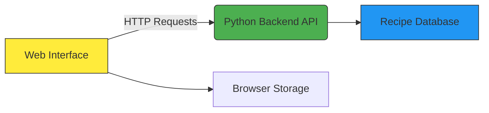

# 🍳 Recipe Chatbot Assistant

**A multi-platform recipe suggestion system** with both CLI (Python) and web interface versions that suggest delicious recipes based on user preferences.


## 🌟 Features

### Core Functionality
- Meal Category Detection (Breakfast, Lunch, Dinner, Dessert)
- Dietary Preference Handling (Quick, Healthy, Vegetarian-friendly)
- 200+ Preloaded Recipes across all meal types

### Web Interface
- 🖥️ Responsive design works on desktop and mobile
- 💬 Interactive chat interface with typing indicators
- 🕒 Message timestamps and history
- 🎨 Food-themed UI with smooth animations

### Python Backend
- 🐍 Pure Python implementation
- 📦 No external dependencies
- 🔍 Advanced recipe matching algorithm
- 💾 Optional JSON recipe database support

## 🚀 Quick Start

### Web Version
```bash
git clone https://github.com/yourusername/recipe-bot.git
cd recipe-bot/web-interface
open index.html  # Or serve using local web server
```

### Python Version
```bash
cd recipe-bot/python-backend
python recipe_bot.py
```

## 🛠️ System Architecture


## 📂 Project Structure
```
recipe-bot/
├── web-interface/          # Frontend components
│   ├── index.html          # Main interface
│   ├── style.css           # Styling
│   ├── script.js           # Chatbot logic
│   └── assets/             # Images/icons
│
├── python-backend/         # Backend components  
│   ├── recipe_bot.py       # Core chatbot engine
│   ├── recipes.json        # Recipe database
│   └── requirements.txt
│
├── docs/                   # Documentation
└── README.md
```

## 💻 Web Interface Details

### Technologies Used
- HTML5 semantic markup
- CSS3 with Flexbox/Grid
- Vanilla JavaScript (no frameworks)
- Responsive design principles

### Key Components

#### Chat Container
- Message history display
- Animated message bubbles
- Auto-scrolling

#### Input System
- Enter key submission
- Input validation
- Typing indicators

#### Visual Design
- Food-themed color palette
- CSS animations
- Adaptive layout

## 🐍 Python Backend Details

### Key Algorithms
- **Intent Recognition:** NLP keyword matching, probability-based scoring
- **Context Management:** Conversation history tracking, meal category memory
- **Recipe Selection:** Direct recipe matching, category-based fallback, random suggestion system

## 🌐 Deployment Options

### Local Use
- Run web interface directly in browser
- Python backend as standalone script

### Web Hosting
- Deploy static files to Netlify/Vercel
- Backend API on PythonAnywhere

### Docker Container
```dockerfile
FROM python:3.9
COPY . /app
WORKDIR /app
CMD ["python", "recipe_bot.py"]
```

## 📝 License
MIT License - see LICENSE for details.

## 🚧 Roadmap
- Add user favorite recipes
- Implement meal planning calendar
- Add nutritional information
- Voice command support
